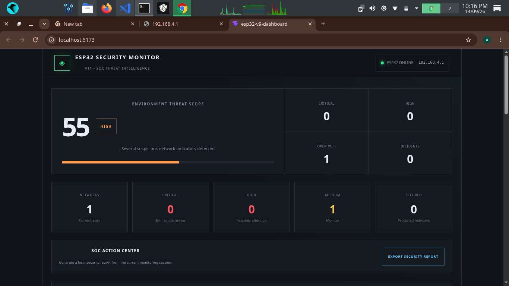
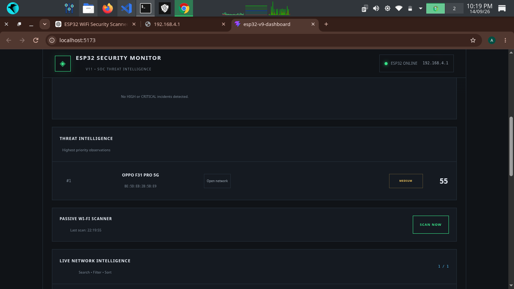
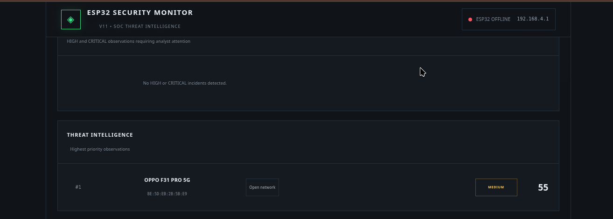
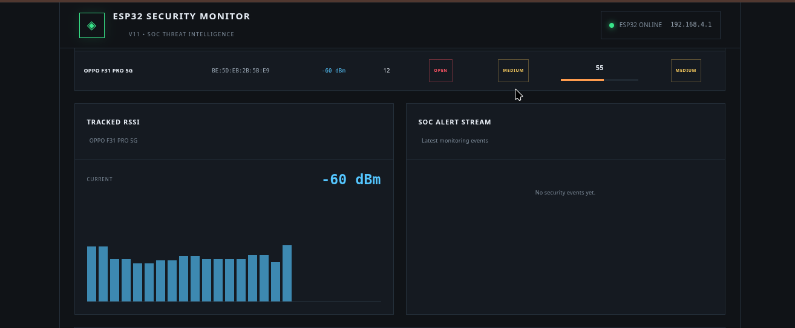
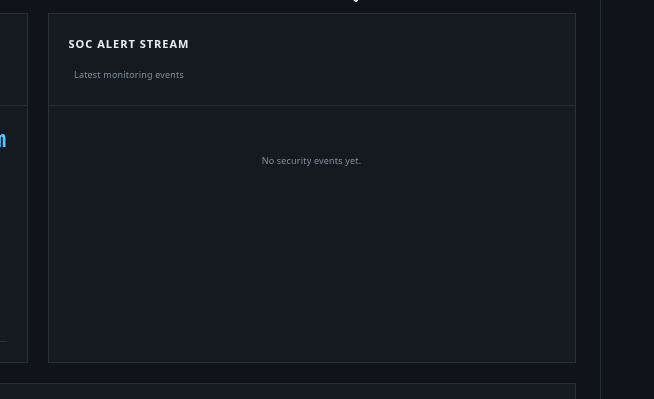
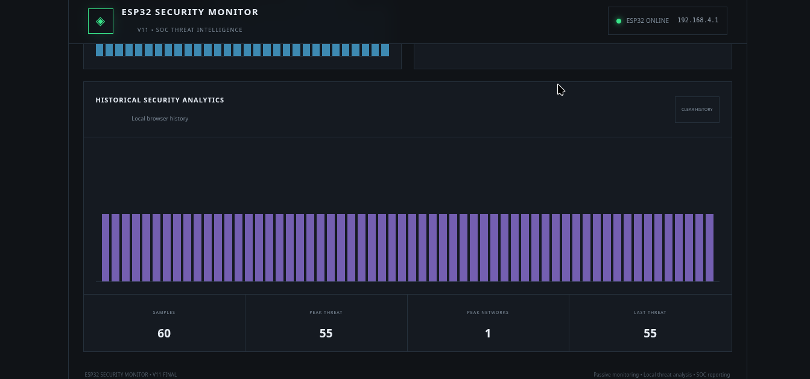

# ESP32 Wi-Fi Security Monitor

## Overview

This project is a practical Wi-Fi security monitoring system built using an ESP32 and a React-based dashboard.

The ESP32 scans nearby Wi-Fi networks and collects information such as SSID, BSSID, RSSI, channel, and security type. The collected data is displayed in a local SOC-style dashboard for monitoring and basic security risk analysis.

## Objective

The objective of this project is to monitor nearby Wi-Fi networks using an ESP32 and analyze their basic security characteristics.

The project aims to identify visible networks, monitor network changes, detect basic security risks, and present the collected information through a local SOC-style dashboard.

## Lab Environment

### Hardware
- ESP32 development board
- USB cable
- Computer/Laptop

### Software
- Arduino IDE
- Visual Studio Code
- Node.js
- React
- Parrot OS

### Network
- ESP32 access point
- 2.4 GHz Wi-Fi network / mobile hotspot
- Local network communication between ESP32 and dashboard


## System Architecture

The project consists of three main components:

1. **ESP32 Wi-Fi Scanner**  
   Scans nearby Wi-Fi networks and collects network information.

2. **REST API**  
   The ESP32 provides the collected data through a local HTTP API.

3. **React SOC Dashboard**  
   Receives the data from the ESP32 and displays network information, security risks, events, and monitoring results.

## Project Setup

The project is divided into two parts:

- **ESP32 Firmware** — Performs Wi-Fi scanning, network monitoring, risk analysis, and provides the REST API.
- **React Dashboard** — Displays the collected information through a local SOC-style security monitoring interface.

### ESP32 Setup

The ESP32 firmware was developed using the Arduino IDE.

The ESP32 operates in Wi-Fi Access Point and Station mode, performs periodic Wi-Fi scans, analyzes discovered networks, and runs a local web server for the dashboard API.

The firmware automatically performs a Wi-Fi scan every 10 seconds and also supports manual scanning through the dashboard.

### React Dashboard Setup

The dashboard was developed using React and runs locally on the computer.

It communicates with the ESP32 through the local REST API and periodically retrieves the latest Wi-Fi scan data.

The dashboard provides a SOC-style interface for viewing network information, security risks, monitoring events, and historical analytics.

## Experiment / Working Process

The ESP32 continuously scans the surrounding Wi-Fi environment and collects information about detected networks.

The collected data is analyzed by the ESP32 and then provided to the React dashboard through the local REST API.

The dashboard periodically requests the latest data and presents the results for security monitoring and analysis.


## Wi-Fi Network Analysis

For each detected Wi-Fi network, the ESP32 collects and analyzes the following information:

- **SSID** — Wi-Fi network name
- **BSSID** — Unique MAC address of the access point
- **RSSI** — Received signal strength
- **Channel** — Wi-Fi channel used by the network
- **Security Type** — Authentication/security mode detected by the ESP32

### SSID Analysis

The SSID represents the visible name of a Wi-Fi network.

The ESP32 records the SSID during each scan so that networks can be identified and monitored over time.

### BSSID Analysis

The BSSID is the MAC address associated with a Wi-Fi access point.

The ESP32 uses the BSSID to distinguish individual access points, even when multiple networks have similar or identical SSIDs.

### RSSI Analysis

RSSI (Received Signal Strength Indicator) represents the strength of the Wi-Fi signal received by the ESP32.

RSSI is measured in dBm. A value closer to 0 generally indicates a stronger received signal, while a more negative value indicates a weaker signal.

The project also monitors significant RSSI changes to identify changes in the observed Wi-Fi environment.

### Channel Analysis

The Wi-Fi channel indicates the radio channel used by the detected access point.

The ESP32 records the channel information for each network, which helps in understanding the surrounding Wi-Fi environment and identifying networks operating on different channels.


### Security Type Analysis

The ESP32 identifies the authentication or security mode advertised by each detected Wi-Fi network.

Networks using open or outdated security configurations are given higher risk scores by the project's rule-based risk analysis.


## Security Risk Analysis

The project uses a rule-based risk scoring system to provide a basic security assessment of detected Wi-Fi networks.

The risk score is calculated using factors such as:

- Open network security
- WEP security
- Strong signal strength
- Newly detected networks
- Significant RSSI changes

Each factor contributes to the overall risk score, which is classified as Low, Medium, or High.


## Network Monitoring & Security Events

The system compares Wi-Fi scan results over time to monitor changes in the surrounding wireless environment.

The project records the following events:

- **NEW NETWORK** — A previously unseen network is detected.
- **DISAPPEARED** — A previously detected network is no longer visible.
- **RSSI CHANGE** — A significant change in the signal strength of an existing network is detected.

These events are displayed in the dashboard for monitoring and analysis.


## Dashboard Analysis

The React dashboard provides a centralized view of the Wi-Fi environment monitored by the ESP32.

It displays network details, threat levels, security events, RSSI information, historical activity, and security alerts in a SOC-style interface.

The dashboard also supports manual scanning, filtering, sorting, and exporting the monitoring report.

## Screenshots / Evidence

The following screenshots document the ESP32 Wi-Fi security monitoring process and dashboard results.

### Dashboard Overview




### Network Scan




### Risk Detection




### RSSI Monitoring




### Security Events




### Historical Analytics




## Findings

The project successfully demonstrated practical Wi-Fi environment monitoring using an ESP32.

The system was able to identify nearby networks, record their SSID, BSSID, RSSI, channel, and security type, and monitor changes across repeated scans.

The React dashboard provided a centralized view of the collected data and highlighted networks requiring further security attention based on the project's rule-based risk scoring.

## Limitations

This project is designed for Wi-Fi monitoring and security learning purposes.

The current implementation does not perform packet capture, password cracking, deauthentication attacks, or confirmation of real-world attacks.

The risk score is rule-based and should be treated as an indication for further investigation rather than a definitive security verdict.

## Future Improvements

Future versions of this project could include:

- Integration with SIEM platforms
- Advanced anomaly detection
- Machine learning-based threat analysis
- Persistent database storage
- More detailed wireless security analysis
- Automated security alerts and notifications


## Technologies Used

- ESP32
- C++
- Arduino IDE
- Wi-Fi
- REST API
- React
- JavaScript
- HTML
- CSS
- Node.js
- Parrot OS

## Project Structure

```text
esp32-security-monitor/
├── esp32/
│   └── ESP32_Security_Monitor/
│       └── ESP32_Security_Monitor.ino
├── src/
├── docs/
│   └── screenshots/
├── package.json
├── index.html
└── README.md

## Security & Ethical Use

This project is intended for authorized security research, education, and laboratory use.

Only monitor Wi-Fi networks and environments where you have permission to perform security testing.

Do not use this project to access, disrupt, or interfere with networks without authorization.


## Conclusion

This project demonstrates how an ESP32 can be used to build a practical Wi-Fi security monitoring system.

By combining ESP32-based wireless scanning with a React SOC-style dashboard, the project provides hands-on experience in network monitoring, security analysis, event detection, REST APIs, and security dashboard development.

## Project Status

**Status:** Completed

The current version includes ESP32-based Wi-Fi scanning, rule-based risk analysis, network event monitoring, a REST API, and a React-based SOC-style dashboard.

## Author

**Sachidanand S**

Computer Science Graduate | Cybersecurity Enthusiast

Interested in SOC Operations, Blue Team Security, Network Security, and Security Research.


## Disclaimer

This project is created for educational and authorized security research purposes only.

The author is not responsible for any misuse, unauthorized monitoring, or illegal activity performed using this project.

## Project Goal

The goal of this project is to understand Wi-Fi security monitoring through hands-on implementation rather than only theoretical learning.

It combines embedded systems, wireless networking, cybersecurity concepts, REST APIs, and a SOC-style security dashboard into a single practical project.
